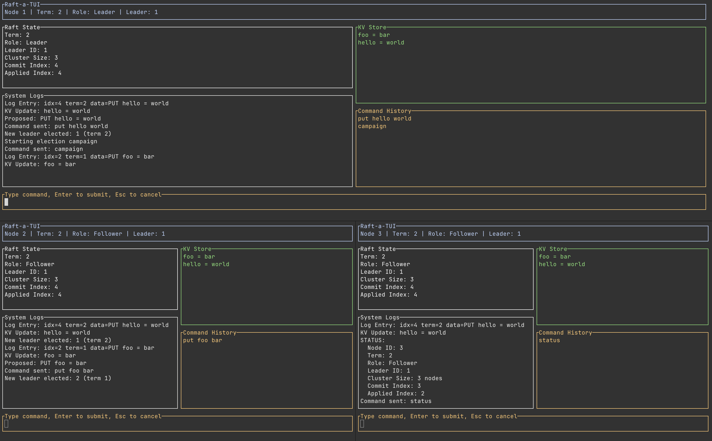

# Raft TUI (raft-a-tui)

An interactive playground for learning about the Raft consensus algorithm and distributed systems, powered by:

1. **[raft-rs](https://github.com/tikv/raft-rs)** for the consensus core.
2. **[ratatui](https://ratatui.rs/)** for terminal UIs.
3. **[tonic](https://github.com/hyperium/tonic)** for gRPC communication between client and cluster.

This project lets you spin up a distributed **KV-Store Cluster** and connect to it with a **Smart Client**. You can watch elections happen in real time, see how log entries replicate across the cluster, and observe how clients handle leader redirection.



---

## Architecture

The project is organized as a workspace with two main binaries:

*   **Server (`raft-server`)**: Runs the Raft node, a TUI for internal state visualization, and a gRPC server for client requests.
*   **Client (`raft-client`)**: A standalone TUI application that sends commands (`PUT`, `GET`) to the cluster. It implements "smart client" logic to automatically find the leader.

## Running the Cluster

You will need 4 terminal windows (3 for servers, 1 for the client).

### 1. Start the Servers

Each server needs to know about its peers.

**Terminal 1 (Node 1):**
```bash
cargo run -p raft-server -- --id 1 --peers 1=127.0.0.1:6001,2=127.0.0.1:6002,3=127.0.0.1:6003
```

**Terminal 2 (Node 2):**
```bash
cargo run -p raft-server -- --id 2 --peers 1=127.0.0.1:6001,2=127.0.0.1:6002,3=127.0.0.1:6003
```

**Terminal 3 (Node 3):**
```bash
cargo run -p raft-server -- --id 3 --peers 1=127.0.0.1:6001,2=127.0.0.1:6002,3=127.0.0.1:6003
```

> **Note**: Servers listen on two ports: the specified Peer Port (e.g., `6001`) for Raft consensus, and `Peer Port + 1000` (e.g., `7001`) for gRPC client API.

### 2. Start the Client

**Terminal 4:**
Connect the client to the gRPC ports (7001, 7002, 7003).

```bash
cargo run -p raft-client -- --peers 127.0.0.1:7001,127.0.0.1:7002,127.0.0.1:7003
```

## Features to Explore

### 1. Log Replication
In the Client TUI, type `put foo bar`.
*   Watch the **Server TUIs** update their logs and State Machines.
*   See the Leader commit the entry and Followers replicate it.

### 2. Smart Client Redirection
1.  Identify the Leader (look for `State: Leader` in Server TUIs).
2.  Kill the Leader process (Ctrl+C).
3.  Wait for a new Leader to be elected in the remaining nodes.
4.  In the Client, type `put hello world`.
5.  Observe how the Client initially fails, receives a redirect, updates its internal leader hint, and successfully retries transparently.

### 3. Eventual Consistency
*   `GET` requests can be served by any node.
*   `PUT` requests are strictly serialized through the Leader.

---

## References & Further Reading

1. **Raft Algorithm** — [https://raft.github.io/](https://raft.github.io/)
2. **raft-rs** (TiKV's Rust implementation) — [https://github.com/tikv/raft-rs](https://github.com/tikv/raft-rs)
3. **Implement Raft in Rust** — [https://tikv.org/blog/implement-raft-in-rust/](https://tikv.org/blog/implement-raft-in-rust/)
4. **TiKV Deep Dive** — [https://tikv.org/deep-dive/introduction/](https://tikv.org/deep-dive/introduction/)
5. **ratatui** — [https://ratatui.rs/](https://ratatui.rs/)